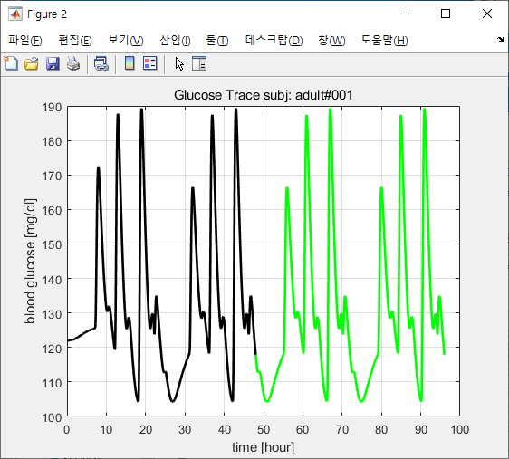

#시나리오 코드
--------------

##1. 기본예시 시나리오

<pre>
  <code>

    simulation info

    %Tsimul=4
    %QTsimul=day    //시뮬레이션의 길이가 4일
    %simToD=0     //시뮬레이션 시작 시 하루의 시간(자정로부터 분 단위)

    closed loop info

    %Tclosed=48     //폐쇄루프 시작
    %QTclosed=hour      // 폐쇄 루프의 단위가 1시간
    %Treg=2880        //규정시작
    meals info   
    %Tmeals=[7 12 18 22 31 36 42 46 55 60 66 70 79 84 90 94]
    %QTmeals=hour
    %Ameals=[45 70 80 20 45 70 80 20 45 70 80 20 45 70 80 20]
    %Dmeals=[15]
    %Qmeals=total
    Open loop insulin info
    %Qbasal=quest
    %OB=on

  </code>
</pre>
## 기본예시 결과

--------------

#

#

## 2. 11일치 하루  3끼 식사량 부분 랜덤, 식사시간 15분
### 인슐린 투여량 하루기준 식사시작 45분 전, 식사량/15 * 0.6 세팅
### 20% 10% 15% 5% 정도의 분배값
<pre>
<code>
%Tsimul=11
%QTsimul=day
%simToD=0

closed loop info
%Tclosed=264
%QTclosed=hour
%Treg=15840

Open loop info

%Tmeals=[435 831 1210 1919 2260 2671 3351 3695 4097 4771 5046 5579 6125 6485 6969 7656 7979 8422 9065 9414 9814 10500 10880 11245 11980 12317 12705 13367 13690 14205 14764 15226 15612]
%QTmeals=min
%Ameals=[37 72 89 51 78 86 36 77 84 49 71 82 43 67 87 40 81 90 40 69 93 51 84 93 52 80 94 38 68 75 41 73 93]
%Dmeals=[15]
%Qmeals=gram
%Tbolus=[377 785 1102 1320 1780 2208 2567 2760 3298 3570 4024 4200 4664 5042 5433 5640 6160 6542 6964 7080 7573 7989 8342 8520 8957 9329 9821 9960 10473 10848 11208 11400 11848 12210 12677 12840 13305 13641 14135 14280 14810 15097 15569 15720]
%QTbolus=min
%Abolus=[3.28 1.64 2.46 0.82 3.28 1.64 2.46 0.82 3.28 1.64 2.46 0.82 3.28 1.64 2.46 0.82 3.28 1.64 2.46 0.82 3.28 1.64 2.46 0.82 3.28 1.64 2.46 0.82 3.28 1.64 2.46 0.82 3.28 1.64 2.46 0.82 3.28 1.64 2.46 0.82 3.28 1.64 2.46 0.82]
</code>
</pre>
