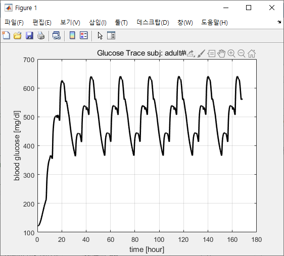
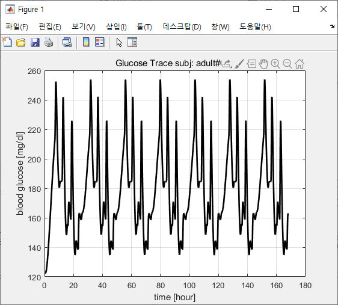
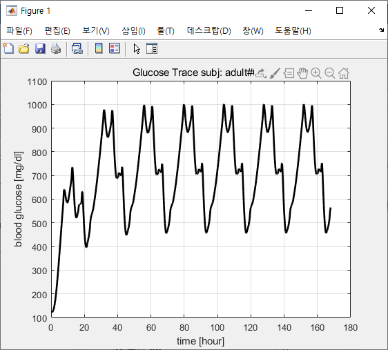
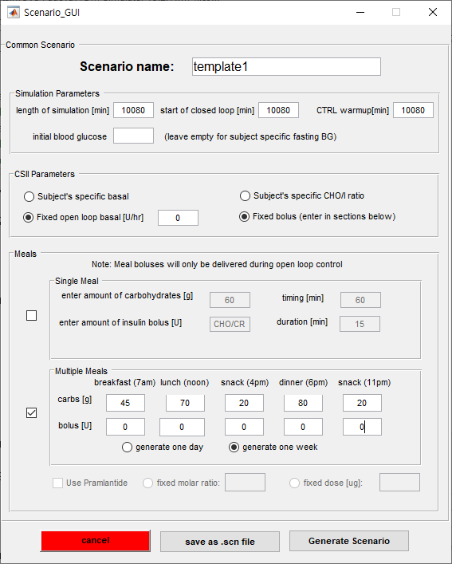

#10/28 심야 작업 기록 현황
--------------------------

### - 업무 현황

-	김익환: 시뮬레이터 테스트

-	김재진: DevC 코드 수정

-	이인재: 기록 및 LSTM이해

###세팅값

#### <모든 open loop GUI 시나리오 파일 생성 결과>

(실험은 #adult001으로 진행)

진행과정은 전부 open loop로 진행

**start of closed loop** = 10080

**CTRL warmup** = 10080 으로 하여 폐쇄루프를 피함)

**주기적으로 주입되는 인슐린** -> 각 환자에 맞는 기본 인슐린양으로 설정

**식사대비 주입 인슐린** -> 우리가 정한 고정된 인슐린값으로 설정하고

혈당추이를 뽑았을때 **가장 안정적인 결과도출**

### 1

---

### 2

---

### 3

---

### 4

---

### 5

---

### 6

---

### 7

---

### 8

---

### 9

---

### 10

---

##시뮬레이터 생성 임시 값

<pre>

<code> %tmeal: 435 831 1210 1919 2260 2671 3351 3695 4097 4771 5046 5579 6125 6485 6969 7656 7979 8422 9065 9414 9814 10500 10880 11245 11980 12317 12705 13367 13690 14205 14764 15226 15612

%Ameal: 48 72 86 51 80 79 38 73 82 42 65 82 52 76 86 43 68 86 41 70 91 44 73 84 41 81 93 41 78 81 35 67 89

%tbolus: 390 786 1165 1874 2215 2626 3306 3650 4052 4726 5001 5534 6080 6440 6924 7611 7934 8377 9020 9369 9769 10455 10835 11200 11935 12272 12660 13322 13645 14160 14719 15181 15567

%abolus: 3.20 4.80 5.73 3.40 5.33 5.27 2.53 4.87 5.47 2.80 4.33 5.47 3.47 5.07 5.73 2.87 4.53 5.73 2.73 4.67 6.07 2.93 4.87 5.60 2.73 5.40 6.20 2.73 5.20 5.40 2.33 4.47 5.93</code>

<pre>
