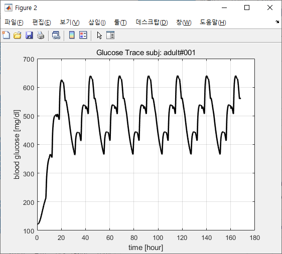
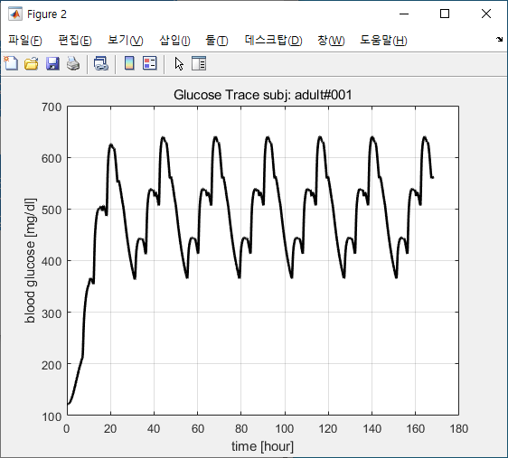
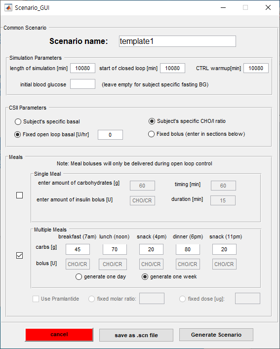

# 10월 28일 진행현황

----------------------

###basal specific cho/o specific

#
#

### basal specific cho/o fixed

#
#

### basal specific cho/o fixed 0

#
#

### basal fixed cho/o specific 0

#
#

### basal fixed cho/o specific

#
#

###basal fixed cho/i fixed

#
#

###basal 0 cho/i specific

#
#

###basal 0 cho/i fixed

#
#

###basal 0 cho/i fixed 0
